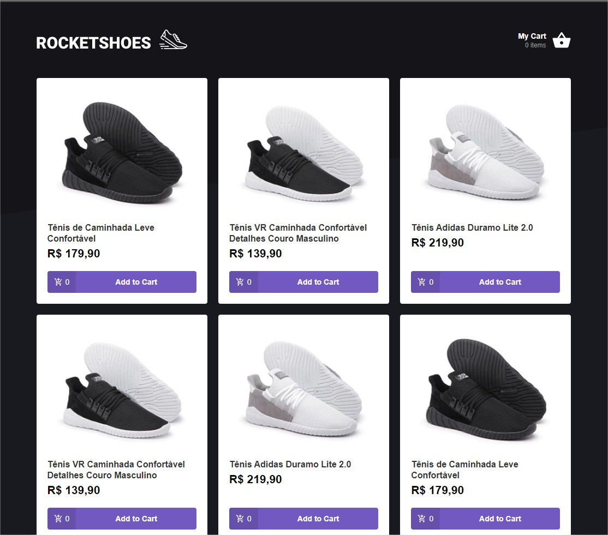
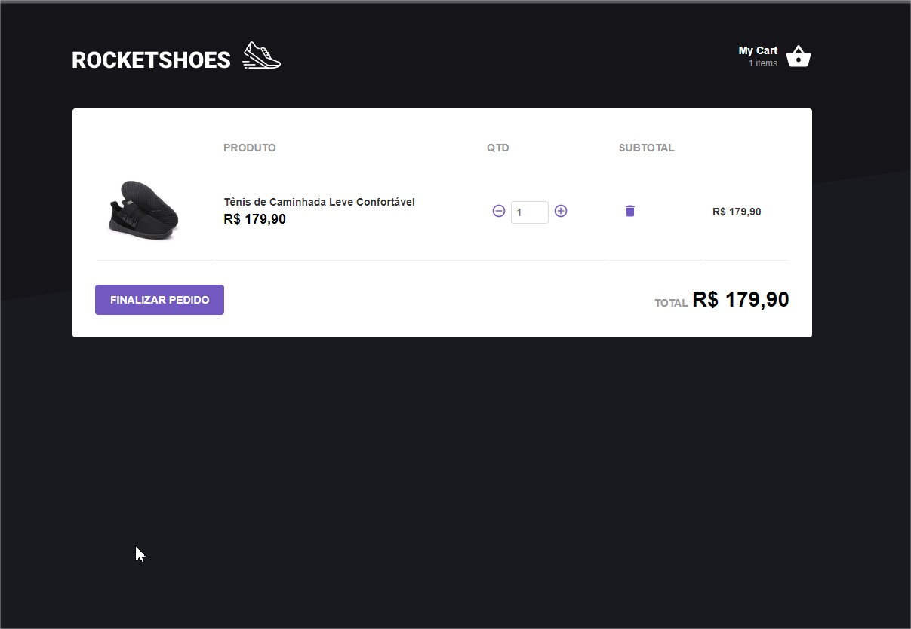
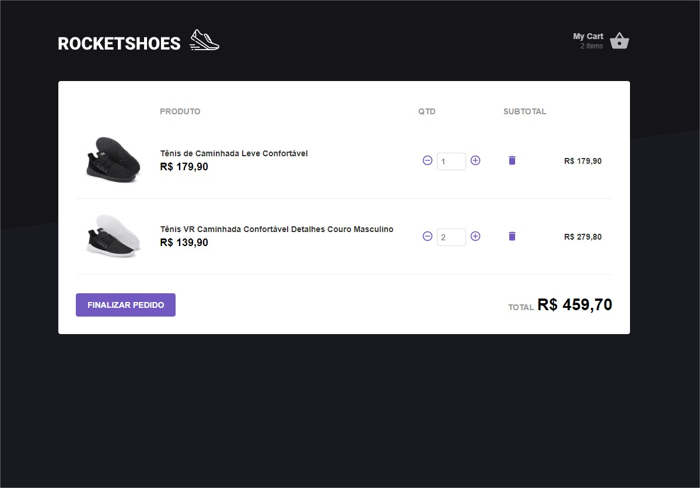

## Rocketshoes

An e-commerce example using React and flux Architecture (Redux, Sagas and Actions)

### How it Works?

-   **Step 1:** Select your product on the list clicking on "Add to Cart":
    

-   **Step 2:** You will be redirect to the Cart list where it will show all products that you have selected:
    

## Flux architecture (Redux and Sagas)

-   To control the items selected on Cart and the amount of each product, it was registered a store called cart, in that store we are able to save a global state and with sagas we could implements custom validations

    

## Setting the enviroment up

### Configure Node.js

Check here how to install [node](https://nodejs.org/en/), please select the stable version

### Configure npm

-   After clone this repo follow the steps below
-   Run `npm install` in your command line, you need to run inside your local repository
-   Then run `react-scripts start`. to listen the app on:`http://localhost:3000/#/`

-   I have used [JsonServer](https://github.com/typicode/json-server) from github that provides a fake API using a locale json, in this case I used `server.json` so run in **another tab** from your **terminal** `npm json-server` to run the API, it will be serve on `localhost:3333`

### Dependeces using yarn

-   Follow the steps to for [yarn instalation](https://nodejs.org/en/).
-   Run `yarn` in your command line to download all dependencies in your source, you need to run inside your local repository
-   Then run `yarn start` to listen the app on:`http://localhost:3000/#/`
-   Run `yarn json-server` to listen the api on:`http://localhost:3333`

### Options Tools

-   I also have set the [Reactotron](https://github.com/infinitered/reactotron) up on this project to control all Sagas and Reducers calls.
